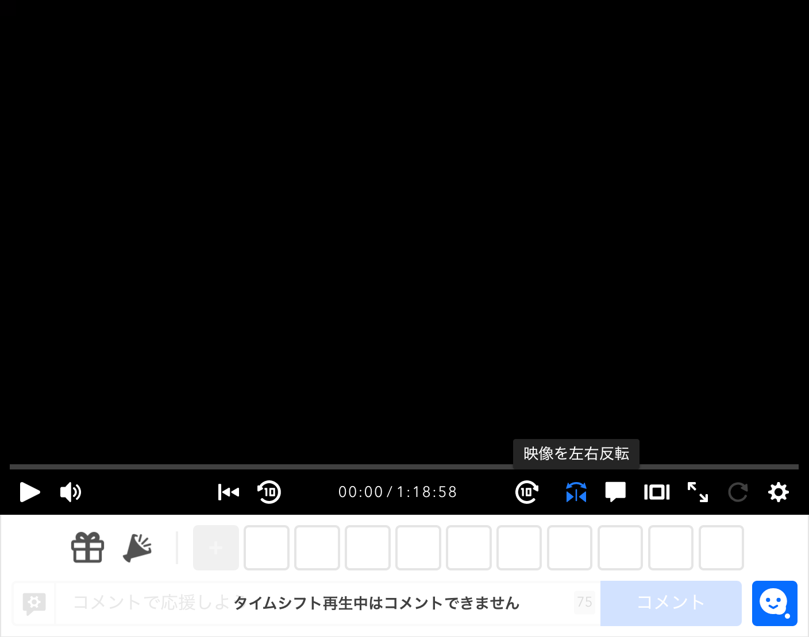

## はじめに

ニコ生の配信アプリでは、フロントカメラの映像はデフォルトで左右反転しています。これは配信者からすると映像は鏡のように見えるので自然ですが(女性の場合は盛れるので反転してるケースも)、視聴者の側からすると文字の判別が困難だったり、車の運転席が逆に見える等の理由で、違和感を抱きます。そのため、フロントカメラが左右反転していると、度々「反転直せ」コメが走ります。

今回は、この問題を視聴者の側で解決できる「映像を反転」ボタンを、PC版のニコ生のプレイヤーに追加するUserJSを作成したので紹介します。

## UserJSの導入

まず、UserJSを管理するための拡張をブラウザにインストールします。筆者のおすすめは[Violentmonkey](https://violentmonkey.github.io/)です。

拡張をインストールしたら以下のリンクからUserJSをインストールします。

> [niconico-live-video-flipper.user.js](https://gist.github.com/emonkak/472e484941911ba724108b01173a893c/raw/niconico-live-video-flipper.user.js)

UserJSがインストールされるとプレイヤーに「映像を左右反転」ボタンが追加されます。ちなみにどうやっているのかと言うと、Video要素に`transform: scale(-1, 1)`をスタイルとして指定しているだけです。

## おわりに

これで、イライラしながら反転直せコメを連投する必要はなくなりました。やったね🥳
