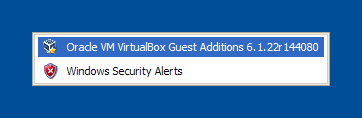
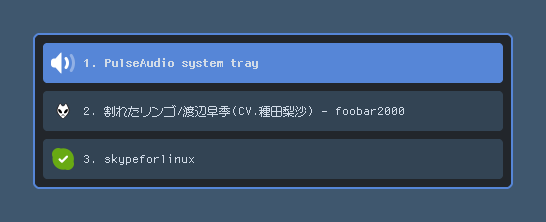
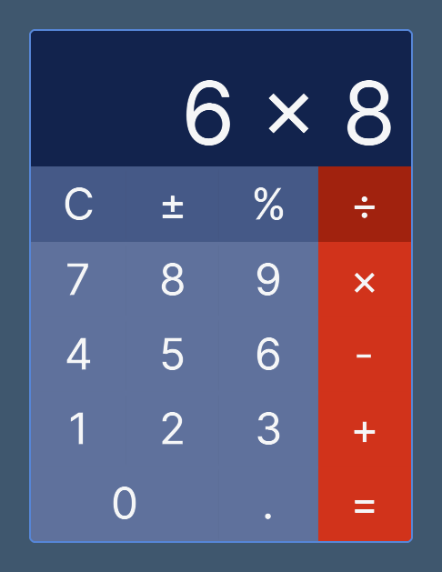

## Introduction

Typically, tiling window managers like [XMonad](https://xmonad.org/) do not have a system tray. If you want a system tray, you can use a standalone implementation like [stalonetray](https://github.com/kolbusa/stalonetray) or a status bar implementation with built-in system tray support, such as [polybar](https://github.com/polybar/polybar).

However, neither of these implementations can't operate the system tray by the keyboard. I think the need for a keyboard-oriented system tray implementation that haves a high affinity with tiling window managers. This idea was inspired by [cereja](https://web.archive.org/web/20140823002645/https://whileimautomaton.net/2006/12/cereja/) an old Windows shell replacement.



So, I created the yet another system tray implementation named "GeekTray" by Rust. This article will how GeekTray was implemented.



> [emonkak/geektray: A keyboard-oriented freedesktop.org system tray implementation for X11](https://github.com/emonkak/geektray/tree/master)

## How to implement a system tray for X11

The system tray for X11 is documented by freedesktop.org as the [System Tray Protocol Specification](https://specifications.freedesktop.org/systemtray-spec/systemtray-spec-latest.html). According to this specification, the system tray is a window that own a special manager selection. And, the tray icon is a window to be embedded in that window. The tray icon is embedded in the system tray in the following steps:

1. The system tray make the manager window that becomes the selection owner aquire `_NET_SYSTEM_TRAY_S{SCREEN_NUM}`. This window can be different one that is used to embed tray icons.
2. If the system tray acquires the selection owner, it should broadcast a `MANAGER` client message. Otherwise, it wait for current selection owner to be destroyed.
3. When the tray icon receives a `MANAGER` client message, it requests dock via `SYSTEM_TRAY_REQUEST_DOCK` to the system tray's manager window.
4. If the system tray receives a dock request from the tray icon, it will embed the tray icon into the embedder window, then it reply `XEMBED_EMBEDDED_NOTIFY` to the tray icon.

I implemented the system tray in Rust using the [x11rb](https://github.com/psychon/x11rb), which provides a low-level API based on [XCB](https://xcb.freedesktop.org/) (XCB is designed as a replacement for [Xlib](https://www.x.org/releases/current/doc/libX11/libX11/libX11.html)). You can see the implementation of the System Tray Protocol in [tray_manager.rs](https://github.com/emonkak/geektray/blob/master/src/tray_manager.rs).

## Rendering the system tray window

In x11rb, you can use the [XRender](https://docs.rs/x11rb/latest/x11rb/protocol/render/index.html) extension, but its API is very low-level and difficult to use directly. Text rendering is particularly difficult because you need to do the rasterization and layout yourself.

Therefore, for graphics and text rendering, it is recommended to combine x11rb with other libraries. In this case, I created a small wrapper named [`RenderContext`](https://github.com/emonkak/geektray/blob/master/src/render_context.rs) to handle drawing by using [cairo-sys](https://docs.rs/cairo-sys-rs/latest/cairo_sys/) and [pangocairo-sys](https://docs.rs/pangocairo-sys/latest/pango_cairo_sys/). Here is its initialization part:

```rust RenderContext::new()
pub fn new(
    connection: Rc<XCBConnection>,
    screen_num: usize,
    window: xproto::Window,
    size: PhysicalSize,
) -> anyhow::Result<Self> {
    let screen = &connection.setup().roots[screen_num];
    let visual_id = connection
        .get_window_attributes(window)?
        .reply()
        .context("get window visual")?
        .visual;
    let (depth, visual) = screen
        .allowed_depths
        .iter()
        .find_map(|depth| {
            depth
                .visuals
                .iter()
                .find(|visual| visual.visual_id == visual_id)
                .map(|visual| (depth.depth, visual))
        })
        .ok_or(anyhow::anyhow!(
            "an optimal visual is not found in the screen"
        ))?;

    let pixmap = connection.generate_id().context("generate pixmap id")?;
    connection
        .create_pixmap(depth, pixmap, window, size.width as u16, size.height as u16)?
        .check()
        .context("create pixmap for render context")?;

    let gc = connection.generate_id().context("genrate gc id")?;
    {
        let values =
            xproto::CreateGCAux::new().subwindow_mode(xproto::SubwindowMode::INCLUDE_INFERIORS);
        connection
            .create_gc(gc, pixmap, &values)?
            .check()
            .context("create gc for render context")?;
    }

    let cairo_surface = unsafe {
        let visual = visual.serialize();
        cairo::cairo_xcb_surface_create(
            connection.get_raw_xcb_connection().cast(),
            pixmap,
            visual.as_ptr() as *mut cairo::xcb_visualtype_t,
            size.width as i32,
            size.height as i32,
        )
    };
    let cairo = unsafe { cairo::cairo_create(cairo_surface) };
    let pango = unsafe { pango_cairo::pango_cairo_create_context(cairo) };

    Ok(Self {
        connection,
        window,
        pixmap,
        gc,
        cairo_surface,
        cairo,
        pango,
        size,
    })
}
```

So let's explain the actual drawing of the tray window. Before drawing, we need to determine the drawing dimension that represents position and size. This process is called layout. The layout is executed in the following timings:

- When the window size is changed.
- When tray icons are added or removed.

The layout is executed by `TrayEmbedder::layout()`. This function updates the dimensions of the tray items to be drawn inside the window, and returns the size of the entire window. 

```rust TrayEmbedder::layout()
pub fn layout(&mut self, ui_config: &UIConfig) -> anyhow::Result<PhysicalSize> {
    log::debug!("layout tray window");

    let window_size = self.size.unsnap();
    let item_height =
        ui_config.icon_size.max(ui_config.text_size) + ui_config.item_padding * 2.0;
    let mut y_offset = ui_config.window_padding;
    let mut total_height = ui_config.window_padding * 2.0;

    if self.tray_items.len() > 0 {
        for (i, tray_item) in self.tray_items.iter_mut().enumerate() {
            let bounds = Rect {
                x: ui_config.window_padding,
                y: y_offset,
                width: window_size.width - ui_config.item_padding * 2.0,
                height: item_height,
            };

            y_offset += bounds.height + ui_config.item_gap;
            total_height += bounds.height;

            if i > 0 {
                total_height += ui_config.item_gap;
            }

            tray_item.bounds = bounds;
        }
    } else {
        total_height += item_height;
    }

    let size = Size {
        width: window_size.width,
        height: total_height,
    }
    .snap();

    set_size_hints(&*self.connection, self.window, size)?;
    resize_window(&*self.connection, self.screen_num, self.window, size)?;

    self.should_layout = false;

    Ok(size)
}
```

When the layout is completed, The `RenderContext` is created based on the size returned by the layout. As a result, the `RenderContext` will be recreated whenever the layout is executed.

Next, the drawing is executed by `TrayEmbedder::draw()`. This function draws the content of the window, updates the positions of the embedded tray icons, and requests a redraw embedded tray icons. This function is called at the following timings:

- When a redraw is requested by an `Expose` event.
- When the title of a tray icon is changed.
- When the selected tray icon is changed.

```rust TrayEmbedder::draw()
pub fn draw(
    &mut self,
    layout_changed: bool,
    ui_config: &UIConfig,
    context: &RenderContext,
) -> anyhow::Result<()> {
    log::debug!("draw tray window");

    let size = context.size().unsnap();

    context.draw_rect(
        Rect {
            x: 0.0,
            y: 0.0,
            width: size.width,
            height: size.height,
        },
        ui_config.window_background,
    );

    if self.tray_items.len() > 0 {
        for (index, tray_item) in self.tray_items.iter_mut().enumerate() {
            let is_selected = self.selected_index.map_or(false, |i| i == index);

            tray_item.draw(index, is_selected, ui_config, context);
        }
    } else {
        context.draw_text(
            "No tray items found",
            &ui_config.normal_item_font,
            ui_config.text_size,
            HAlign::Center,
            VAlign::Middle,
            Rect {
                x: ui_config.window_padding,
                y: 0.0,
                width: size.width - (ui_config.window_padding * 2.0),
                height: size.height,
            },
            ui_config.window_foreground,
        );
    }

    context.flush()?;

    for tray_item in &self.tray_items {
        if !tray_item.should_map {
            continue;
        }

        if layout_changed {
            let values = xproto::ConfigureWindowAux::new()
                .x((tray_item.bounds.x + ui_config.item_padding) as i32)
                .y((tray_item.bounds.y + ui_config.item_padding) as i32)
                .width(ui_config.icon_size as u32)
                .height(ui_config.icon_size as u32);
            self.connection
                .configure_window(tray_item.icon, &values)?
                .check()
                .context("move and resize tray icon")?;
        }

        if tray_item.is_mapped {
            self.connection
                .clear_area(
                    true,
                    tray_item.icon,
                    0,
                    0,
                    ui_config.icon_size as u16,
                    ui_config.icon_size as u16,
                )?
                .check()
                .context("request redraw tray icon")?;
        } else {
            self.connection
                .map_window(tray_item.icon)?
                .check()
                .context("map tray icon")?;
        }
    }

    self.connection
        .flush()
        .context("flush after draw tray window")?;

    self.should_redraw = false;

    Ok(())
}
```

The rendering pipeline, consisting of layout and drawing, is executed within the event loop before starting the next polling when the event queue becomes empty. The following `App::handle_tick()` does this:

```rust App::handle_tick()
fn handle_tick(&mut self) -> anyhow::Result<()> {
    if self.tray_embedder.is_mapped() {
        let should_layout = self.tray_embedder.should_layout() || self.render_context.is_none();

        if should_layout {
            let new_size = self.tray_embedder.layout(&self.config.ui)?;
            self.render_context = Some(RenderContext::new(
                self.connection.clone(),
                self.screen_num,
                self.tray_embedder.window(),
                new_size,
            )?);
        }

        if should_layout || self.tray_embedder.should_redraw() {
            let render_context = self.render_context.as_ref().unwrap();
            self.tray_embedder
                .draw(should_layout, &self.config.ui, render_context)?;
        }
    }

    Ok(())
}
```

Great! With this, I was able to render the UI without using GUI toolkits like GTK+.

## Handling key events

GeekTray is a keyboard-oriented system tray. When a user inputs a key, it needs to execute the corresponding action. However, with X11, only the physical number (Keycode) of the key is obtained, and it is not clear what the key (Keysym) it is assigned to.

In Xlib, there is `XKeycodeToKeysym()` to convert keycode to keysym, but in x11rb (XCB), such a function does not exist. I used [xkbcommon](https://xkbcommon.org/) for this implementation (I think the implementation based on the X Keyboard Extension is too complex and I don't want to implement it myself).

I generated bindings to use xkbcommon for Rust and created [a simple wrapper](https://github.com/emonkak/geektray/blob/master/src/xkbcommon.rs) for it. Those implementations are taken inspiration from [druid-shell](https://github.com/linebender/druid/tree/master/druid-shell).

## Conclusion

Through the implementation of GeekTray, I learned how to create a simple GUI application without using any frameworks or toolkits. Of course, for applications that have complex UI, some kind of framework will be necessary.

In the past, I worked on a declarative UI framework called [YuiUI](https://github.com/emonkak/yuiui) for that purpose. The experience gained from developing on YuiUI has been applied to the GeekTray. In the future, I might write an article explaining YuiUI and its development process.


