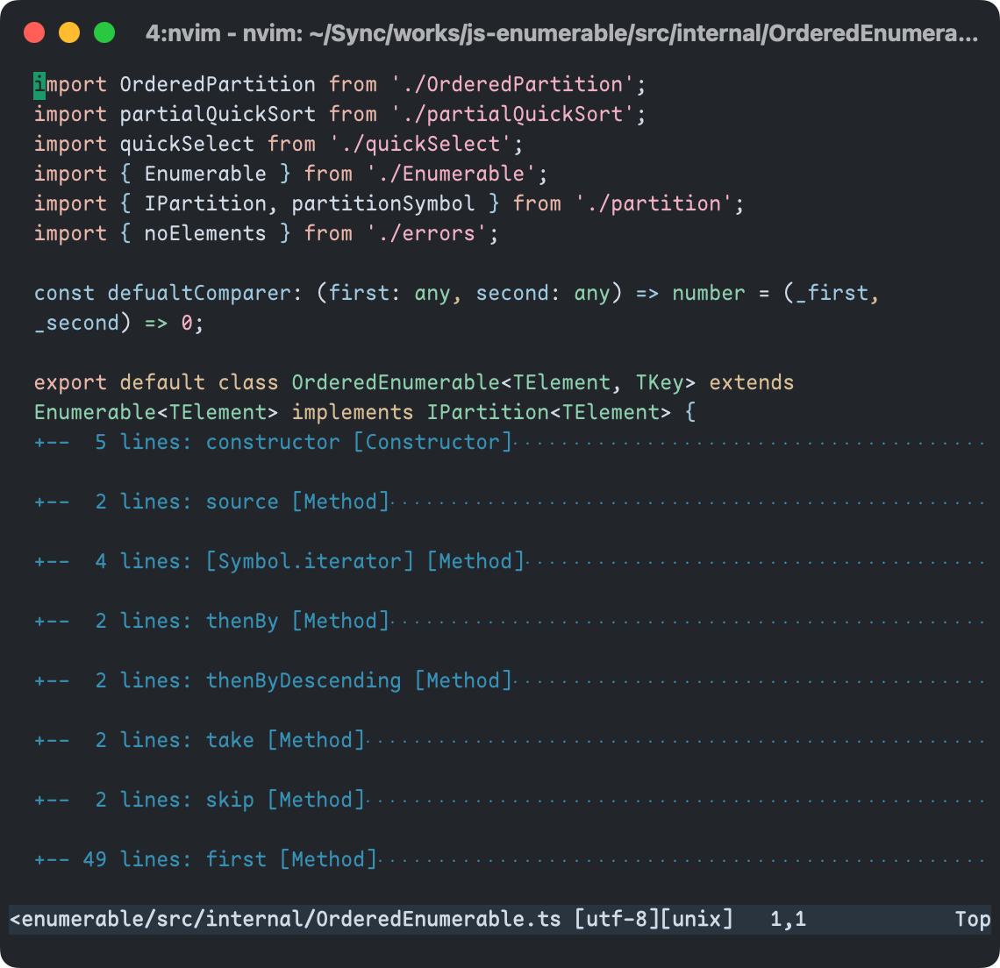
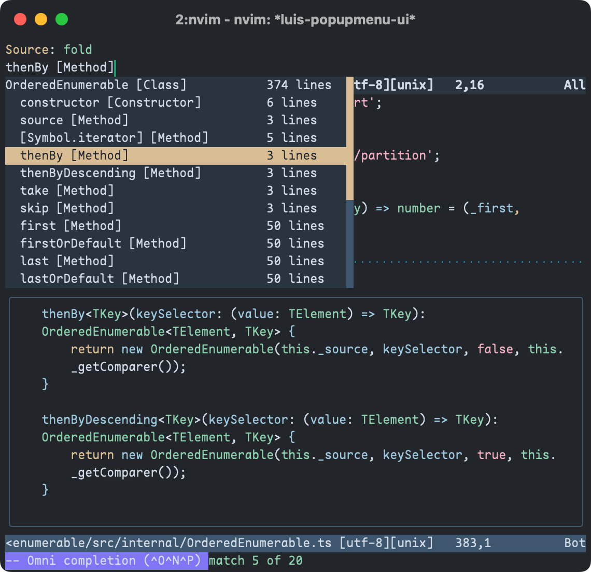
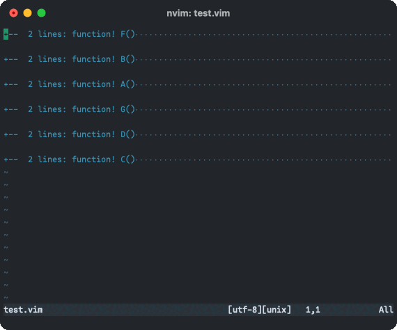

## はじめに

Vimで十分に活用されていない組み込み機能の一つは[折り畳み(Folding)](https://vimdoc.sourceforge.net/htmldoc/fold.html)だと思います。私は以前から折り畳みを様々な手段で活用しており、特にお気に入りの機能の一つになっています。この記事では、私がどのように折り畳みを設定しているのか、さらには折り畳みを活用するためのプラグインについてみなさんに共有します。

## 折り畳みを定義する方法

折り畳みは`'foldmethod'`に設定する値に応じて、次の方法で定義することができます。

> - `manual`: 手動で折り畳みを定義する
> - `indent`: インデントの数を折り畳みのレベル(深さ)とする
> - `expr`: 折り畳みを定義する式を指定する
> - `syntax`: 構文強調により折り畳みを定義する
> - `diff`: 変更されていないテキストを折り畳み対象とする
> - `marker`: テキスト中の印で折り畳みを定義する

**Caption:** https://vim-jp.org/vimdoc-ja/fold.html#fold-methods

この中で特に良く使われるのは`expr`と`marker`でしょう。`marker`はソースに`{{{`のようなマーカーを埋め込むことで、好きな場所に折り畳みを定義することができます。しかし、Vim以外のエディターを使うユーザーにとっては、マーカーは意味のない邪魔な文字列でしかなく、共同編集するソースで使うことはためらわれます。私は、行数の多い個人的なアプリケーションの設定ファイル(vimrcなど)でのみ、`marker`を使用するのがいいと思います。

`expr`はどうでしょう？`expr`では`'foldexpr'`に設定された任意の式を評価し、得られた折り畳みレベルを表す特別な値から折り畳みが定義されます。`'foldexpr'`はファイルタイプに応じて適切なもの設定する必要がありますが、残念ながら組み込みの定義は何もありません。つまり`'foldexpr'`の設定は自分で定義するか、それを行う何らかのプラグインを導入する必要があります。

私は`'foldexpr'`を設定する独自の[Filetype Plugin](https://github.com/emonkak/config/tree/master/vim/after/ftplugin)をいくつかのファイルタイプについて作成しました。以降では私がどのように`'foldexpr'`を設定したのか、そして`'foldexpr'`による折り畳みの限界について説明します。

> **Warning:** この記事で定義する折り畳みの要件
>
> この記事では折り畳みをソースのアウトライン表示のために使います。そこにはクラス、メソッド、関数などの宣言が含まれるでしょう。一方で、ifやfor文などの制御構造は含まれて欲しくありません。以降で説明する折り畳みはこの要件を前提にして定義されることに注意して下さい。

### foldexprの基本的な定義

`'foldexpr'`は評価されると、次のような折り畳みレベルを表す特別な値を得る式です。式の中では現在の計算対象の行を表す`v:lnum`が利用できます。

> | 値             |  意味
> | -------------- | ----------------------------------------------------------------------------------------
> | 0              | 対象行は折り畳みに含まれない
> | 1, 2, ..       | 対象行はこのレベルの折り畳みに含まれる
> | -1             | 折り畳みレベルを未定義とし、対象行の直前か直後の行のうち低い方を、対象行のレベルとする。
> | "="            | 直前の行と同じレベルを使用する
> | "a1", "a2", .. | 直前の行のレベルを+1, +2して、結果を現在の行に適用する。
> | "s1", "s2", .. | 直前の行のレベルを-1, -2して、結果を現在の行に適用する。
> | "<1", "<2", .. | 指定したレベルの折り畳みを対象行で終了する
> | ">1", ">2", .. | 指定したレベルの折り畳みを対象行から開始する

**Caption:** https://vim-jp.org/vimdoc-ja/fold.html#fold-expr

この時、注意すべきなのは、この式はバッファの編集中に何度も評価されるので、パフォーマンスに可能な限り配慮するべきということです。

> NOTE: 各行について式評価が実行されるので、この折り畳み方式は非常に動作が遅くなる可能性がある!

**Caption:** https://vim-jp.org/vimdoc-ja/fold.html#fold-expr

そのため、`'foldexpr'`の式では対象の言語の文法を厳密に解釈しようとするのではなく、対象の行かその前後に、特定のトークンがあるかどうかをパターンで照合するのが基本となるでしょう。例えば、VimScriptでの折り畳みは次のように定義できます。

```viml VimScriptの折り畳み設定
setlocal foldexpr=VimFold(v:lnum)
setlocal foldmethod=expr

function! VimFold(lnum) abort
  let current = getline(a:lnum)
  if current =~# '^\s*fu\%[nction]!\?\>'
    return 'a1'
  elseif current =~# '^\s*endf\%[unction]\s*$'
    return 's1'
  endif
  return '='
endfunction
```

この関数は計算対象の行が`function`か`endfunction`であるかに応じて、折り畳みレベルを増減させています。この時、`function`は入れ子にすることができることから、折り畳みレベルを`a1`、`s1`で指定することで相対的に増減させています。インデントから絶対的なレベルを計算することができると思うかもしれませんが、次のような`if`ブロック中で定義された関数で折り畳みレベルが狂うので、相対的な指定の方がより良いです。

```viml ifブロック中にある関数定義
if has('nvim')
  function! Greet() abort
    echo 'Hello NeoVim!'
  endfunction
endif
```

さらに、VimScriptではLuaの埋め込み等のヒアドキュメントについても考慮する必要があります。例えば次のようにLuaスクリプトが埋め込まれたソースでは、現在行を確認するだけでは不十分です。この場合`function greet()`の行が`function`と一致するので、誤って折り畳みの開始がされますが、`end`は折り畳みの終了を表す`endfunction`とは一致しないので、最後まで折り畳みは終了しません。

```viml VimScriptに埋め込まれたLua
lua << EOF
function greet()
  print('Hello Lua!')
end
greet()
EOF
```

このような問題を回避するためには、`function`と`endfunction`が確かにVimScriptにおける関数の開始と終了を表すトークンかどうかを確認する必要があります。幸いなことに私達にはその手段があります。それは構文ハイライト(Syntax Highlighting)です。構文ハイライトを使うことで先の関数は次のように改良することができます。

**Update(2024-05-22):** 関数定義のハイライトのチェックを修正しました。

```viml 構文ハイライトを使った改良版のVimScriptの折り畳み設定
function! VimFold(lnum) abort
  let current = getline(a:lnum)

  if current =~# '^\s*fu\%[nction]!\?\>'
    if s:check_syntax(a:lnum, match(current, '\S') + 1, ['vimFunction', 'vimCommand'])
      return 'a1'
    endif
  elseif current =~# '^\s*endf\%[unction]\s*$'
    if s:check_syntax(a:lnum, match(current, '\S') + 1, ['vimEndfunction', 'vimCommand'])
      return 's1'
    endif
  endif

  return '='
endfunction

function! s:check_syntax(lnum, col, expected_syntax_names) abort
  for syntax in synstack(a:lnum, a:col)
    let name = synIDattr(syntax, 'name')
    if index(a:expected_syntax_names, name) >= 0
      return 1
    endif
  endfor
  return 0
endfunction
```

ただし、`foldexpr`での構文ハイライトの確認は、パフォーマンスの悪化を避けるために、最小限に抑えるべきです。今回の関数では、行に関数の開始と終了を表すトークンが含まれることを確認した上で構文を確認することで、不要な確認を避けています。

> **Note:** foldmethod=syntaxはどうですか？
>
> Vimが構文ハイライトの結果からトークンの種類を取得できるなら、その結果を利用して折り畳みを定義することができますね？そのための`foldmethod`の設定は既にありました。`syntax`です。
>
> `syntax`は構文ハイライトの結果を利用して、折り畳み可能とマークされた範囲を折り畳む設定です。しかし、構文ハイライトが行うのはテキスト中のトークンを特定して(それは構文解析というより字句解析です)、それをハイライトすることなので、関数やクラスの定義というような意味のある範囲を特定して折り畳むことは苦手です。
>
> 例えば、C言語のような`{}`でブロックを定義するような文法の場合、そのブロックが関数定義のものなのかifやfor文のブロックのものなのかは、普通は構文ハイライトから判断できるようにはなっていません。そのような場合、特定の種類のブロックに限定して折り畳みを定義することは困難です(実際に、組み込みのJavaのsyntaxの折り畳みでは`{}`で囲われた範囲をそれが何を示すのかに関わらず、すべて折り畳まれます)。
>
> では、syntaxの定義をより厳密にすることでこの問題を解決できるでしょうか？残念ながら、それは現在の構文ハイライトの仕様では困難だと思います。もし[TextMate文法による構文ハイライト](https://github.com/vim/vim/issues/9087)が実現したなら、この問題は解決できるかもしれません。
>
> さらに、syntaxに関連する別の折り畳み方法として、Treesitterによる構文解析の結果から折り畳みを定義することを考えることができます。[nvim-treesitter](https://github.com/nvim-treesitter/nvim-treesitter)はそのための実験的な機能を提供しています(現時点では残念ながら動作しませんでした)。
> 
> **Update(2024-06-14):** 再度確認した所期待通り動作したので、Treesitterによる折り畳みの項を加筆しました。

### foldexprを定義するのが難しい言語

VimScriptでの折り畳みは、関数の開始と終了は`function`、`endfunction`と専用のトークンが割り当てられているので、その判定は簡単でした。一方で、例えばC言語では関数の宣言に開始と終了を表す専用のトークンがないので、少なくともその折り畳みは(厳密に構文解析しない限り)困難です。

```c C言語には関数の開始と終了を表すトークンはない
void greet() {
  printf("Hello, World!");
}
```

これがRustの場合なら折り畳み対象のブロックにはその開始を示すトークンが必ずあるため(関数なら`fn`、構造体なら`struct`など)、少なくとも折り畳みの開始は正しく定義できます。しかし、一方でその終了はすべて`}`で表されるので、折り畳みの終了を適切に判定することは困難です。これは、実際には折り畳み対象のブロックが開始していないにも関わらず、折り畳みが終了される可能性を意味します。詳しくは後で説明しますが、誤って折り畳みが終了すると、次行から意図しない折り畳みが開始される場合があります。

```rust Rustでは関数の開始はfnで表される
fn greet() {
  println!("Hello world!");
}
```

この問題は折り畳みを入れ子にできる数(`'foldnestmax'`)を制限することで、不完全ながらもある程度抑止することができます。実際に、次のRust用の`'foldexpr'`の設定では、インデントから折り畳みレベルを計算するとともに、そのレベルが3以下である場合にのみ、折り畳みが定義されるよう制限しています。

```viml Rust用のfoldexpr定義
setlocal foldmethod=expr
setlocal foldexpr=RustFold(v:lnum)
setlocal foldnestmax=3

function! RustFold(lnum)
  let current = getline(a:lnum)

  if current =~# '^\s*\%('
  \            . 'macro_rules!'
  \            . '\|\%(unsafe\s\+\)\?impl\>'
  \            . '\|\%(pub\%(\s*(\s*\%(crate\|super\)\s*)\)\?\s\+\)\?\%(const\s\+\)\?\%(unsafe\s\+\)\?\%(async\s\+\)\?\%(extern\s\+"[^"]\+"\s\+\)\?\%(enum\|fn\|mod\|struct\|trait\|union\)\>'
  \            . '\)'
  \  && current !~# '[;}]\s*$'
    let level = indent(a:lnum) / shiftwidth() + 1
    if level <= &l:foldnestmax
      return '>' . level
    endif
  elseif current =~# '^\s*}\s*$'
    let level = indent(a:lnum) / shiftwidth() + 1
    if level <= &l:foldnestmax
      return '<' . level
    endif
  endif

  return '='
endfunction
```

この設定は多くの場合適切に機能しますが、次のソースでは誤った折り畳みが作成されます。

```
lnum   level   foldexpr   line
------------------------------------------------------
1      1       >1         pub fn main() {
2      1       =              loop {
3      1       =                  if true {
4      1       =                      println!("loop")
5      1       <3                 }
6      2       =                  break;
7      2       <2             }
8      1       <1         }
```

**Caption:** 誤った折り畳みが作成されるRustソース

誤った折り畳みが作成される原因となるのは5行目の`}`です。この行では実際にはレベル3の折り畳みが開始していないにも関わらず、レベル3の折り畳みの終了が定義されています。その結果、次行から終了した折り畳みの一つ下のレベル2の折り畳みが開始されてしまいます。

これはVim本体のバグである可能があります。少なくともドキュメント化されていない動作です。しかし、これはVimの初期のバージョンからのもので、修正することで既存の`foldexpr`の設定を壊す可能性があります(恐らく実用上の問題は起きない)。そうだとしても、この動作は予期できない望ましくない動作であるので、バグとして報告しました。

**Update(2024-01-18):** この問題は[Vim 9.1.0002](https://github.com/vim/vim/commit/0689b870595c687a23e102913ce5037f65d03748)で修正されました。

> [An unexpected fold is started when "<2" is specified in "foldexpr" · Issue #12768 · vim/vim](https://github.com/vim/vim/issues/12768)

この問題が本体で修正されるまでは、Vim(NeoVim)に次のパッチを当ててビルドすることで、この問題を回避することができます。

```diff 折り畳みの終了時に決して新しい折り畳みを作成しないようにする(Vim用)
--- a/src/fold.c
+++ b/src/fold.c
@@ -3362,7 +3362,7 @@ foldlevelExpr(fline_T *flp)
          break;

    // "<1", "<2", .. : end a fold with a certain level
-   case '<': flp->lvl_next = n - 1;
+   case '<': flp->lvl_next = MIN(flp->lvl, n - 1);
          flp->end = n;
          break;
```

```diff 折り畳みの終了時に決して新しい折り畳みを作成しないようにする(NeoVim用)
--- a/src/nvim/fold.c
+++ b/src/nvim/fold.c
@@ -2960,7 +2960,7 @@ static void foldlevelExpr(fline_T *flp)

   // "<1", "<2", .. : end a fold with a certain level
   case '<':
-    flp->lvl_next = n - 1;
+    flp->lvl_next = MIN(flp->lvl, n - 1);
     flp->end = n;
     break;
```

この修正によって、少なくとも先のRustの折り畳みは、ほとんど完璧に機能するようになります。一方で、C言語の関数のような開始を表すトークンがない場合の折り畳みは、依然として困難です。それを解決する良い方法はないでしょうか？それが以降で紹介するLSP(Language Server Protocol)とTreesitterによる折り畳みです。

> **Note:** foldexpr内でfoldlevel()を呼び出すことはできますか？
>
> `:help foldlevel()`によると`foldlevel()`は`'foldexpr'`内であっても制約付きではあるものの、呼び出すことは可能です。
>
> > ('foldexpr' の中で)折り畳みを更新している最中に呼ぶと、まだ折り畳みを更新していなく、折り畳みレベルが未知の行に対しては-1を返す。特別な場合として、普通は1行前のレベルは取得できる。
>
> **Caption:** https://vim-jp.org/vimdoc-ja/builtin.html#foldlevel()
>
> 説明通りなら、前の行の折り畳みレベルが取得することで、終了しようとしている折り畳みレベルが本当に開始しているかどうか確認することができます。そうすれば、開始していない折り畳みを誤って終了することは無くなります。
>
> しかし、実際には`foldlevel()`は前の行であってもほとんどの場合-1を返すので、この問題の解決には役立ちませんでした。

### LSPによる折り畳み

LSPには変数、クラス、インターフェスなどのプログラム構造を表す[`DocumentSymbol`](https://microsoft.github.io/language-server-protocol/specifications/lsp/3.17/specification/#DocumentntSymbol)というデータ構造があります。今回はこのデータ構造を折り畳みを定義するために使います。

`DocumentSymbol`を取得するためにはLanguage Serverにリクエストを送ってデータを取得する必要があります。
しかし、リクエストは非同期に行われ、その応答と折り畳みの更新のタイミングは一致しないので、実装には工夫が必要でした。

本項では、LSPによる折り畳みをどのように実装したのか説明します。LSPクライアントにはNeoVim組み込みのものを使用したので、動作対象はNeoVimに限られることに注意して下さい。

> **Note:** FoldingRangeを使わないのは何故ですか？
>
> LSPには、まさに折り畳みのためのデータ構造を表す[`FoldingRange`](https://microsoft.github.io/language-server-protocol/specifications/lsp/3.17/specification/#foldingRange)がありますが、今回はそれを使いませんでした。何故なら`FoldingRange`は、ソース中のあらゆる折り畳むことのできる範囲を表すものだからです。今回のようにソースのアウトラインとなるような範囲に限定して折り畳みを定義するなら`DocumentSymbol`の方が適切です。

#### 同期版のLSPによる折り畳み実装

LSPによる折り畳みは`'foldexpr'`に設定する関数として実装します。まずは折り畳みのベースとなる`DocumentSymbol`を取得する必要があるでしょう。最初の実装ではシンプルに`'foldexpr'`から同期版のリクエスト関数(`buf_request_sync`)を呼び出して、Language Serverにリクエストを送信することにします。

```lua 同期版のLSPによる折り畳み実装
local function calculate_fold_levels(symbols, folds, level)
  if level > vim.wo.foldnestmax then
    return
  end
  for _, symbol in ipairs(symbols) do
    if symbol.range['end'].line - symbol.range.start.line > vim.wo.foldminlines then
      folds[symbol.range.start.line + 1] = '>' .. level
      folds[symbol.range['end'].line + 1] = '<' .. level
      if symbol.children then
        calculate_fold_levels(symbol.children, folds, level + 1)
      end
    end
  end
end

local M = {}

function M.setup(bufnr)
  vim.api.nvim_set_option_value('foldmethod', 'expr', { buf = bufnr })
  vim.api.nvim_set_option_value(
    'foldexpr',
    'v:lua.require("lsp_fold").foldexpr(v:lnum)',
    { buf = bufnr }
  )
end

function M.foldexpr(lnum)
  local bufnr = vim.api.nvim_get_current_buf()
  local changedtick = vim.api.nvim_buf_get_changedtick(bufnr)
  local cache = vim.b.lsp_fold_cache or { folds = {} }

  if cache.changedtick ~= changedtick then
    local line_count = vim.api.nvim_buf_line_count(bufnr)
    for i = 1, #cache.folds do
      cache.folds[i] = '='
    end
    for _ = 1, line_count - #cache.folds do
      table.insert(cache.folds, '=')
    end
    local params = {
      textDocument = vim.lsp.util.make_text_document_params(bufnr),
    }
    local responses = vim.lsp.buf_request_sync(
      bufnr,
      'textDocument/documentSymbol',
      params
    )
    if responses then
      for _, response in ipairs(responses) do
        if response.result then
          calculate_fold_levels(response.result, cache.folds, 1)
        end
      end
    end
    cache.changedtick = changedtick
    vim.b.lsp_fold_cache = cache
  end

  return cache.folds[lnum] or -1
end

return M
```

この実装では、現在のバッファの変更回数を表す[`changetick`](https://vim-jp.org/vimdoc-ja/eval.html#changetick)の値を追跡して、バッファが変更された時にLanguage Serverにリクエストを送って折り畳みのキャッシュを更新します。以降、`changetick`が変更されるまでは、キャッシュされた折り畳みレベルを参照してそれを返します。

この実装は、最初にバッファが読み込まれた時点ではうまく機能しました。しかし、バッファに何らかの変更が発生すると、折り畳みは壊れてしまいました。この時のLanguage Serverの応答を調べると、変更前の一つ古いバッファの状態を元に`DocumentSymbol`を返しているようです。それは何故でしょうか？

原因を調べるためにNeoVimのLSPクライアントのソースを参照すると、LSPクライアントは[`nvim_buf_attach()`](https://neovim.io/doc/user/api.html#nvim_buf_attach())の`on_lines`コールバックでバッファの変更内容を送信していることがわかりました[^nvim_lsp_tracking_changes]。恐らく、`'foldexpr'`の評価はこのコールバックが実行される前にされています。だとすると、`DocumentSymbol`のリクエストを、LSPクライアントが変更内容を送信した後に実行することで問題は解決するでしょう。

[^nvim_lsp_tracking_changes]: https://github.com/neovim/neovim/blob/b9e75e575148b956190eb017bb1f6a492d6902ae/runtime/lua/vim/lsp.lua#L1861

#### 非同期版のLSPによる折り畳み実装

先の同期版の実装では`DocumentSymbol`のリクエストを`'foldexpr'`で行なっていましたが、今回の実装ではその処理は`nvim_buf_attach()`で登録したコールバックか、最初に初期化関数が呼ばれた時に、非同期で実行されます。その後、`DocumentSymbol`の応答を受け取ると、そこから折り畳みレベルを計算して、結果をモジュール内の変数に保存します。それらを行うのが次の関数です。

```lua 非同期版のLSPによる折り畳みの初期化関数
function M.attach(bufnr)
  local state = fold_states[bufnr]

  if state then
    -- This buffer has already been setup. So reuse the state that already
    -- exists and abort detaching.
    state.detached = false
    return
  end

  vim.api.nvim_buf_attach(bufnr, false, {
    on_lines = function(event, bufnr, changedtick)
      local state = fold_states[bufnr]
      if state then
        get_document_symboles(bufnr, state, changedtick)
        return state.detached
      end
    end,
    on_reload = function(event, bufnr)
      local state = fold_states[bufnr]
      if state then
        local changedtick = vim.api.nvim_buf_get_changedtick(bufnr)
        get_document_symboles(bufnr, state, changedtick)
        return state.detached
      end
    end,
    on_detach = function(event, bufnr)
      local state = fold_states[bufnr]
      if state then
        if state.request then
          state.request()
          state.request = nil
        end
        if vim.api.nvim_buf_is_loaded(bufnr) then
          restore_fold_options(bufnr, state)
        end
        fold_states[bufnr] = nil
      end
    end,
  })

  state = new_state(bufnr)
  fold_states[bufnr] = state

  local changedtick = vim.api.nvim_buf_get_changedtick(bufnr)
  configure_fold_options(bufnr)
  get_document_symboles(bufnr, state, changedtick)
end
```

折り畳みレベルが更新されたなら、`'foldexpr'`の再評価を要求する必要があります。それを行うのが次の関数です。ここでは折り畳みが更新された時のちらつき防止するために`'lazyredraw'`を有効にしています。この対策は残念ながら完璧ではありません。完全にちらつきを防止するにはVim本体の何らかのサポートが必要だと思います。

**Update(2024-06-04):** `winsaveview()`と`winrestview()`でウィンドウの状態を復元するように修正しました。

```lua 折り畳みの再評価関数
local function update_folds(bufnr)
  local original_lazyredraw = vim.go.lazyredraw
  local view = vim.fn.winsaveview()

  vim.go.lazyredraw = true

  -- Reconfigure 'foldmethod', which forces a re-evaluation of 'foldexpr'.
  vim.api.nvim_set_option_value('foldmethod', 'expr', { scope = 'local' })

  -- The fold under the cursor may be closed, so reopen it.
  if vim.fn.foldclosed(view.lnum) >= 0 then
    vim.cmd.foldopen({ bang = true, range = { view.lnum, view.lnum } })
  end

  vim.fn.winrestview(view)
  vim.go.lazyredraw = original_lazyredraw
end
```

**Update(2024-06-14):** 組み込みのtreesitterの折り畳み関数`vim.treesitter.foldexpr()`ではネイティブ実装された非公開API [`vim._foldupdate()`](https://github.com/neovim/neovim/blob/27fb62988e922c2739035f477f93cc052a4fee1e/src/nvim/lua/stdlib.c#L549)を呼び出して[折り畳みを更新](https://github.com/neovim/neovim/blob/27fb62988e922c2739035f477f93cc052a4fee1e/runtime/lua/vim/treesitter/_fold.lua#L270)しています。この実装を参考して先程の関数を書き直すことで、折り畳み更新時のちらつきは完全に解消されました！

```lua
local function update_fold(bufnr, top, bottom)
  for _, win in ipairs(vim.fn.win_findbuf(bufnr)) do
    if vim.wo[win].foldmethod == 'expr' then
      vim._foldupdate(win, top, bottom)
    end
  end
end

local function request_update_fold(bufnr)
  if vim.api.nvim_get_mode().mode:match('^i') then
    if #(vim.api.nvim_get_autocmds({ group = group, buffer = bufnr })) > 0 then
      return
    end
    vim.api.nvim_create_autocmd('InsertLeave', {
      group = augroup,
      buffer = bufnr,
      once = true,
      callback = function()
        update_fold(bufnr, 0, vim.api.nvim_buf_line_count(bufnr))
      end,
    })
  else
    vim.schedule(function()
      if vim.api.nvim_buf_is_loaded(bufnr) then
        update_fold(bufnr, 0, vim.api.nvim_buf_line_count(bufnr))
      end
    end)
  end
end
```

**Caption:** `vim._foldupdate()`を使った改良版の折り畳みの再評価関数

最後に、`'foldexpr'`で呼び出されるのが次の関数です。折り畳みレベルは事前に計算されているので、この関数ではそれらを参照して行番号に対応するレベルを返すだけです。

```lua 非同期版のLSPによる折り畳み実装のfoldexpr関数
function M.foldexpr(lnum)
  local bufnr = vim.api.nvim_get_current_buf()
  local state = fold_states[bufnr]
  if state == nil then
    return -1
  end
  local fold = state.folds[lnum]
  if fold == nil then
    return state.levels[lnum] or '='
  elseif fold.type == TYPE_START then
    return '>' .. fold.level
  else
    return '<' .. fold.level
  end
end
```

実装のすべては次のリンクから参照することができます。

> [config/config/nvim/lua/lsp_fold.lua at master · emonkak/config](https://github.com/emonkak/config/blob/master/vim/lua/lsp_fold.lua)

この実装を使用するには、`lsp_fold.lua`を`'runtimepath'`の`lua`ディレクトリに配置して、`LspAttach`のイベントコールバックから次のように呼び出します。

```lua lsp_fold.luaの設定
vim.api.nvim_create_autocmd('LspAttach', {
  callback = function(args)
    local client = vim.lsp.get_client_by_id(args.data.client_id)
    if client.server_capabilities.documentSymbolProvider then
      require('lsp_fold').setup(args.buf)
    end
  end
})
```

そうすると、LSPが有効なバッファでは以下のような折り畳みが定義されます。これで自分の手で`'foldexpr'`を定義するのが難しい言語であっても、LSPの力を借りて折り畳みを定義できるようになりました！



## Treesitterによる折り畳み

前項のLSPによる折り畳みの実装では、バッファーの内容が更新される度にDocumentSymbolの一覧をすべて取得し直して、折り畳みレベルを再計算していました。そのため、バッファーの内容が巨大だとパフォーマンスの問題が発生する可能性があります。もし、バッファーの変更された部分だけを更新することができればより効率的です。Treesitterによる折り畳みはこれを実現することができます。

Treesitterによる折り畳みを使用するには、組み込みのAPIの`vim.treesitter.foldexpr()`を`'foldexpr'`として設定します。私はFileTypeイベントの発行時、対応するパーサーがインストールされていかどうかを確認して、これを自動的に設定するようにしています。

> **Warning:**
>
> [nvim-treesitter](https://github.com/nvim-treesitter)の`nvim_treesitter#foldexpr()`は[非推奨であり削除が予定されている](https://github.com/nvim-treesitter/nvim-treesitter/issues/5643#issuecomment-1803245240)ため、組み込みの`vim.treesitter.foldexpr()`を使うべきです。

```lua Treesitterによる折り畳みの設定
vim.api.nvim_create_autocmd('Filetype', {
  callback = function(args)
    if require('nvim-treesitter.parsers').has_parser(args.match) then
      vim.api.nvim_set_option_value('foldmethod', 'expr', { scope = 'local' })
      vim.api.nvim_set_option_value(
        'foldexpr',
        'v:lua.vim.treesitter.foldexpr()',
        { scope = 'local' }
      )
    end
  end,
})
```

この時、折り畳みの対象となるノードはランタイムディレクトリ内の`queries/{filetype}/folds.scm`で定義されます。これらは[組み込み](https://github.com/neovim/neovim/tree/master/runtime/queries)、あるいは[`nvim-treesitter`](https://github.com/nvim-treesitter/nvim-treesitter)でいくつかのファイルタイプについての設定が提供されます。

しかし、いずれの設定も関数やクラスの定義だけではなく、ifブロック等も折り畳みの対象となるので、この記事が目標とするソースのアウトライン表示には都合が悪いです。Treesitterのクエリは先に読み込まれたものが優先されるので、ユーザー設定で置き換えと良いでしょう。

折り畳みの設定を置き換えるには`folds.scm`を`~/.config/nvim/queries/{filetype}/`以下に作成します。例として、私はLuaの折り畳みを以下のように定義しています。

```
[
  (function_declaration)
  (function_definition)
] @fold
```

**Caption:**  Luaの折り畳み定義。関数の宣言と定義のみを対象とする。

> **Warning:** inheritsが指定されたクエリを置き換える時の注意
>
> Treesitterのクエリは`inherits: {lang}...`モードラインを使用することで任意のファイルタイプのものを継承することができます[^treesitter-query-modeline-inherits]。`inherits`が指定されたクエリはユーザー設定で置き換えられると、先に継承されたファイルタイプのクエリが読み込まれた後に、ユーザー設定のクエリが読み込まれます。つまり両者は結合されます。
> 
> したがって、`inherits`が指定されたクエリをユーザー設定で置き換える時は、その継承元のクエリも置き換える必要があります。例えば、`nvim-treesitter`では[`typescript`の折り畳みの設定](https://github.com/nvim-treesitter/nvim-treesitter/blob/master/queries/typescript/folds.scm)は[`ecma`の設定](https://github.com/nvim-treesitter/nvim-treesitter/blob/master/queries/ecma/folds.scm)を継承しているので`ecma`のものも置き換える必要があります。
>
> この動作は直感的ではなく、バグだと疑われるので私は次のissueとして報告しました。
>
> > [Treesitter queries specified in the "inherits:" modeline are always merged, even if there is an overridden query · Issue #29348 · neovim/neovim](https://github.com/neovim/neovim/issues/29348)
>
> [^treesitter-query-modeline-inherits]: https://neovim.io/doc/user/treesitter.html#treesitter-query-modeline-inherits

## 折り畳みに対する操作

これまで私が定義した折り畳みはソースのアウトラインとなる範囲を示すものでした。これらの範囲を使うことで、関数やクラスの定義に対する操作を提供できます。私はそのために、これから説明する2つのプラグインを作りました。

### 折り畳みのアウトライン表示

私はいわゆるFuzzy Finderプラグインとして[ku](https://github.com/kana/vim-ku)を長く使ってきました。しかし、残念ながらkuは2009年に開発が停止していて、最新のVim(NeoVim)の進化に追従できていません(今でも使うことはできますが)。そこで、私はkuをフォークして[Luis](https://github.com/emonkak/vim-luis)(**L**ookup **UI** for **S**ourcesの頭文字)という新しいプラグインを作りました。Luisでは候補を収集するための様々なソースが提供されます。本項では、その中からfoldソースの実装について説明します。Luis自体の説明はまた別の記事で詳しくしたいと思います。

Luisのfoldソースはバッファ中の折り畳みを候補として収集するもので、次の図のように動作します。



候補が確定されると、その候補が示す折り畳みが開かれて、カーソルはその先頭行に移動します。また、選択中の候補が示す折り畳みは、ポップアップメニュー下部のウィンドウにプレビューされます。

これはまさに、ソースコードのアウトライン表示として機能します！専用のプラグインなしに、組込みの機能である折り畳みとFuzzy Finderプラグインを組み合わせることでアウトライン表示を実現できました。もし、新しい`'filetype'`をアウトライン表示に対応させたければ、そのための`'foldexpr'`を設定すれば良いです(そのための方法はこれまで説明してきました)。私はシンプルで拡張性が高いこのやり方をとても気に入っています。

foldソースの折り畳みの収集部分は次のようなっています。この実装1つですべての`'foldmethod'`の設定に対応しています(`expr`に限定するならウィンドウの移動なしに実装することができますが汎用性が失なわれます)。実装は非常にシンプルなので、他のFuzzyFinderプラグインに移植するのも簡単です。

```viml foldソースの折り畳みの収集部分
function! s:Source.on_source_enter(context) abort dict
  let original_window = win_getid()
  let original_lazyredraw = &lazyredraw

  " Suppress the redrawing during collecting folds.
  set lazyredraw
  " Go to the target window.
  noautocmd call win_gotoid(self.window)
  " Duplicate the target window.
  split

  let bufnr = winbufnr(self.window)
  let candidates = []

  try
    " Close all existing folds.
    normal! zM
    for lnum in range(1, line('$'))
      let foldstart = foldclosed(lnum)
      if foldstart > 0
        let foldtext = s:remove_foldtext_decorations(foldtextresult(lnum))
        let foldend = foldclosedend(lnum)
        let indent = repeat(' ', (foldlevel(lnum) - 1) * 2)
        call add(candidates, {
        \   'word': foldtext,
        \   'abbr': indent . foldtext,
        \   'menu': (foldend - foldstart + 1) . ' lines',
        \   'dup': 1,
        \   'user_data': {
        \     'buffer_nr': bufnr,
        \     'buffer_cursor': [lnum, 1],
        \     'preview_bufnr': bufnr,
        \     'preview_cursor': [lnum, 1],
        \   },
        \   'luis_sort_priority': -lnum,
        \ })
        execute lnum 'foldopen'
      endif
    endfor
  finally
    close
    noautocmd call win_gotoid(original_window)
    let &lazyredraw = original_lazyredraw
  endtry

  let self.cached_candidates = candidates
endfunction
```

### 折り畳みの並べ替え

みなさんは、関数やメソッドの定義をどのような順序で並べますか？私は、より粒度の大きな関数を上に、他の関数から呼ばれる粒度の小さな関数を下に並べることが多いです。とはいえ、その基準は曖昧なもので、同じような粒度の関数がいくつもあると、どのように並べるか迷うことがあります。そのような時には、関数の定義を辞書順に並べ変えることを検討します。

私はまさにそれを行うための[foldsort](https://github.com/emonkak/vim-foldsort)というプラグインを作りました。このプラグインは選択された範囲内にある折り畳み同士を入れ替えて並べ変えるための`:FoldSort`コマンドを提供します。`:FoldSort`には引数としてパターンを指定することもできます。その場合は折り畳みが示す範囲の中からパターンに一致する文字列を抽出して、その文字列を基準に並べ変えます。パターンが指定されない場合は、折り畳みの先頭行の文字列が基準になります。

このプラグインと、これまで定義してきた折り畳みの設定を組合せることで、関数やメソッドの定義を辞書順に並び換えることができます。それを行なっているのが次の動画です。



## おわりに

これまで述べてきたように、私は折り畳みを有用な機能だと信じていますが、過小評価されていると思います。

一方、この記事を書く過程でいくつかの問題も見付かりました。`'foldexpr'`にはバグのような動作があり(修正されました)、非同期に折り畳みを更新するとちらつきが発生します(非公開の`vim._foldupdate()`を使うと回避可能です)。NeoVimにおいてはLua用の折り畳みAPIはありません。そして、折り畳みの設定もいくらか面倒です(それを行うプラグインが必要かもしれません)。

それでも折り畳みが有用であることに変わりありません。みなさんもこの記事を参考に折り畳みを活用してみて下さい！
