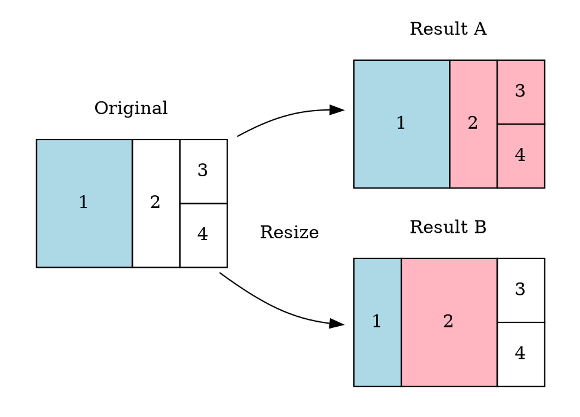

## はじめに

XMonadで3列以上のレイアウトを提供するモジュールとして、[xmonad-contrib](https://hackage.haskell.org/package/xmonad-contrib)の[`ThreeColumns`](https://hackage.haskell.org/package/xmonad-contrib-0.17.1/docs/XMonad-Layout-ThreeColumns.html)と[`MultiColumns`](https://hackage.haskell.org/package/xmonad-contrib-0.17.1/docs/XMonad-Layout-MultiColumns.html
)が存在する。`ThreeColumns`は3列固定のレイアウトで、`MultiColumns`は列数が動的に増減するレイアウトだ。しかし、いずれのレイアウトも筆者の要求を満たすものではなく、新しいレイアウトを独自に作成するに至った。

それが`StableColumns`というレイアウトで、事前に定義した列のキャパシティに応じてウィンドウを配置する。配置するための列が動的に増減せず*Stable*であるという意味で名付けた。

本稿では、筆者が作成したマルチカラムレイアウト`StableColumns`を紹介するとともに、どのような要求の下でこれを作ったのかを述べる。

> [config/StableColumns.hs at master · emonkak/config](https://github.com/emonkak/config/blob/master/xmonad/lib/XMonad/Layout/StableColumns.hs)

## 要求1：列へのウィンドウの配置順をカスタマイズ

まず、3カラムレイアウトを使う時の筆者の代表的な使い方は以下のようなものだ。

- 左列：ターミナルを配置する作業用の領域
- 中央列：Webブラウザを配置する資料閲覧用の領域
- 右列：動画再生用の領域

そのためには、以下のような順序でウィンドウが配置されて欲しい。

```dot 理想とする3カラムレイアウトのウィンドウ配置
digraph {
  bgcolor = transparent

  A [
    fixedsize = true
    width = 3
    height = 2
    shape = record
    label = "1|2|{3|4|5}"
  ]
}
```

しかし、`ThreeColumns`ではこのような配置順にはならない。もし、`ThreeCol 1 (3/100) (1/2)`のようにレイアウトを定義したなら、最初のウィンドウは一番左のメイン列に配置され、以降のウィンドウは右二つの列に交互に配置される。

```dot ThreeColumnsのウィンドウ配置
digraph {
  bgcolor = transparent

  A [
    fixedsize = true
    width = 3
    height = 2
    shape = record
    label = "1|{2|4}|{3|5}"
  ]
}
```

そこで、理想の配置順を実現する設計として、列ごとに収納できるウィンドウの数(キャパシティ)を設定できようにすることを考えた。具体的には、*多くとも*N個までのウィンドウを配置する**StaticColumn**、*少なくとも*N個のウィンドウを配置する**DynamicColumn**という2つの列の変種を考えた。コード中の列の定義は以下のようになっている。

```haskell StableColumnsの列の定義
data Column = Column
  { columnKind :: ColumnKind
  , columnRatio :: Rational
  , columnRowRatios :: [Rational]
  }
  deriving (Read, Show)

data ColumnKind
  = ColumnKindStatic Int
  | ColumnKindDynamic Int
  deriving (Read, Show)

staticColumn :: Int -> Rational -> [Rational] -> Column
staticColumn n = Column (ColumnKindStatic n)

dynamicColumn :: Int -> Rational -> [Rational] -> Column
dynamicColumn n = Column (ColumnKindDynamic n)
```

この時、列には以下のような手順でウィンドウが配置される。

1. 定義されたすべての列を左から順に走査して、列のキャパシティが0になるまでウィンドウを配置する。
2. 未配置のウィンドウをDynamicColumnの列に対して左から順に1枚ずつ配置する。
3. 未配置のウィンドウがなくなるまで**手順2**を繰り返す。

> **Warning:** StableColumnsの制限
>
> 今回作成したレイアウトではウィンドウは必ず左の列から右へ順に配置される。したがって、`ThreeColumns`の`ThreeColMid`コンストラクターで実現できるレイアウトのように、3列の中央の列をメインウィンドウが配置されるMaster Paneとするような設定はできない。

この手順による実際のウィンドウの配置の流れを示す。まず、レイアウトに以下のような3つの列が設定されているとする。

```haskell StableColumnsの列の設定
columns =
  [ staticColumn 1 (2/1)
  , dynamicColumn 1 (1/4)
  , dynamicColumn 3 (1/4)
  ]
```

この時、4つのウィンドウを配置することを考える。まず、**手順1**によって左列から順にキャパシティが0になるまでウィンドウを配置する。この場合、右列のみキャパシティを1残してすべてのウィンドウは配置される。未配置のウィンドウはないのでここで配置は終了し、配置は以下のようになる。

```dot StableColumnsで4つのウィンドウを配置した例
digraph {
  bgcolor = transparent

  A [
    fixedsize = true
    width = 3
    height = 2
    shape = record
    label = "1|2|{3|4}"
  ]
}
```

続いて、同じ設定で6つのウィンドウを配置することを考える。まず、**手順1**によってキャパシティの空いてる列に5つのウィンドウが配置される。すべてのキャパシティは消費されたので、残る1つのウィンドウは**手順2**によってDynamicColumnの最初の列(中央列)に配置される。

```dot StableColumnsで6つのウィンドウを配置した例
digraph {
  bgcolor = transparent

  A [
    fixedsize = true
    width = 3
    height = 2
    shape = record
    label = "1|{2|6}|{3|4|5}"
  ]
}
```

このアルゴリズムによって、`ThreeColumns`相当のレイアウトも、2列や4列以上のレイアウトも実現できる柔軟性を手に入れることができた。なお、列のキャパシティは[`IncMasterN`](https://hackage.haskell.org/package/xmonad-0.17.1/docs/XMonad-Layout.html#t:IncMasterN)メッセージによって、動的に増減させることができる。

## 要求2：列間の境界線をリサイズ

次は、列のリサイズについて考える。列が二つしかないならリサイズする方法は自明だが、列が三つ以上ある時にはリサイズする方法は二つ考えられる。一つは列そのものをリサイズする方法で、もう一つが列の境界をリサイズ方法だ。その違いを示したのが以下の図で、左列 を半分の幅に縮小した時のリサイズ結果の違いを表している。



図中の**Result A**が左列そのものをリサイズした結果で、左列が縮小した分だけ中心と右の列の大きさが拡張されている。**Result B**は左の列と中心の列の境界をリサイズした結果で、この場合は中心列の大きさのみが拡張されている。

この点について、`ThreeColumns`ではどの列にフォーカスが当たっているかは関係なく、左列(`ThreeColMid`なら中心列)しかリサイズできない。リサイズ方法としては前者の「列そのものをリサイズする方法」を取っている。

一方、`StableColumns`では現在フォーカスのある列に対して、後者の「列の境界をリサイズする方法」でリサイズを実行する。これによってすべての列がリサイズ可能になるとともに、列をリサイズした時の動作が直感的に感じられるようになる。

## StableColumnsを使用する

XMonadの設定ファイルはデフォルトではGHCによって直接コンパイルされる。この時、GHCにはコマンドラインオプションとして`-ilib`が与えられるので、設定ディレクトリ内の`lib`にHaskellソースを置くことで外部モジュールを読み込むことができる。

したがって、`StableColumns`のようなパッケージ管理されていない外部モジュールを使用するには、`lib`ディレクトリに[ソース](https://github.com/emonkak/config/blob/master/xmonad/lib/XMonad/Layout/StableColumns.hs)を直接コピーすればいい。

```
$ mkdir -p ~/.xmonad/lib/XMonad/Layout
$ curl https://raw.githubusercontent.com/emonkak/config/master/xmonad/lib/XMonad/Layout/StableColumns.hs -o ~/.xmonad/lib/XMonad/Layout/StableColumns.hs
```

> **Note:** 設定ファイルのビルドにCabalかStackを利用する場合
>
> XMonadでは独自にビルドスクリプトを設置することで、CabalやStackで設定ファイルをビルドするように指示することもできる。その場合は通常のパッケージと同様に外部モジュールを管理すれば良い。また、Stackを使うだけであれば設定ディレクトリに`stack.yaml`を設置するだけで、XMonadが自動的にStackを呼び出してコンパイルしてくれる。この辺りの動作は公式には文章化されていないが、`Xmonad.Core`の[`detectCompile`](https://github.com/xmonad/xmonad/blob/5cdddab1f156c7470d51aee445a00823dad604c1/src/XMonad/Core.hs#L591)と[`compile`](https://github.com/xmonad/xmonad/blob/5cdddab1f156c7470d51aee445a00823dad604c1/src/XMonad/Core.hs#L652)に記述されている。
>
> 筆者の場合、Cabalでコンパイルさせるために、以下のようなビルドスクリプトを設置している。なお、ビルドスクリプトの引数には出力先となるバイナリのパスが引数として与えらる。
> 
> ```shell Cabalでコンパイルするビルドスクリプト
> #!/bin/env bash
> 
> set -o errexit -o nounset
> 
> cabal build
> bin="$(cabal list-bin xmonad)"
> [ -f "$bin" ] && install "$bin" "$1"
> ```
> 
> その他の設定については以下を参照されたい。
> 
> > [config/xmonad at master · emonkak/config](https://github.com/emonkak/config/tree/master/xmonad)

`XMonad.Layout.StableColumns`がimportできるようになったなら、レイアウトは以下ように定義できる。

```haskell StableColumnsのレイアウト定義例
import XMonad.Layout.StableColumns

-- 3カラムレイアウト
threeColumnLayout = stableColumns
  (3/100)  -- 列方向のリサイズ量
  ((3/100) * (16/9))  -- 行方向のリサイズ量
  [ staticColumn 1 (1/2) []  -- 多くとも1つのウィンドウを表示
  , dynamicColumn 1 (1/4) []  -- 少なくとも1つのウィンドウを表示
  , dynamicColumn 3 (1/4) []  -- 少なくとも3つのウィンドウを表示
  ]

-- 2カラムレイアウト
twoColumnLayout = stableColumns
  (3/100)  -- 列方向のリサイズ比率
  ((3/100) * (16/9))  -- 行方向のリサイズ比率
  [ staticColumn 1 (1/2) []  -- 多くとも1つのウィンドウを表示
  , dynamicColumn 1 (1/4) []  -- 少なくとも1つのウィンドウを表示
  ]
```

レイアウトに対してメッセージを送信するキーバインドは以下のように定義できる。`ShrinkRow`と`ExpandRow`は`StableColumns`が独自に定義した`ResizeRow`型のコンストラクターで、他のメッセージは`XMonad.Layout`からimportしたものだ。

```haskell メッセージ送信のキーバインド設定例
import XMonad
import XMonad.Layout.StableColumns
import qualified Data.Map as M

myLayoutKeys conf@(XConfig { XMonad.modMask = modMask }) = M.fromList $
  [ ((modMask,               xK_comma),  sendMessage $ IncMasterN (-1))  -- 列のキャパシティを1減らす
  , ((modMask,               xK_period), sendMessage $ IncMasterN (1))  -- 列のキャパシティを1増やす
  , ((modMask,               xK_h),      sendMessage Shrink)  -- 列を縮小する
  , ((modMask,               xK_l),      sendMessage Expand)  -- 列を拡大する
  , ((modMask .|. shiftMask, xK_h),      sendMessage ShrinkRow)  -- 行を縮小する
  , ((modMask .|. shiftMask, xK_l),      sendMessage ExpandRow)  -- 行を拡大する
  ]
```

## まとめ

XMonadではxmonad-contribを利用することで様々なレイアウトを利用することができるが、細部で自分の好みに合わない所がある場合もある。XMonadのレイアウト関数は`Rectangle`と`Window`のペアの一覧を返すだけの単純なものなので、Haskellが書けるなら(それが難しいかもしれないが)レイアウトをフォークして改造することは容易だ。`StableColumns`の実装も`ThreeColumns`をフォークする所から始まった。

今回の`StableColumns`についてもあくまで作者の使い方に合うよう作られた実装なので、読者の好みには合わない部分があるかもしれない。それでも、今回の実装が改造のベースとして役立てれば嬉しい。


